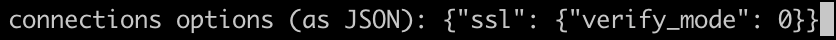

<!--
# @title command: 'setup'
-->
# Setup

```sh
imap-backup setup
```

This command starts the interactive, menu-driven setup tool.

By default, the tool saves a configuration file in `~/.imap-backup/config.json`.

## Custom Configuration Path

You can override the location where the file is accessed and stored with the `--config` parameter:

```sh
imap-backup setup --config /home/me/.local/imap-backup/config.json
```

In this case, it is up to you to create the directory for the configuration file.

# Account Setup

## `modify password`

Note that the password is held in plain text in the configuration file.

You can avoid having your password held in plain text in the configuration file
by providing an environment variable name preceded with a dollar sign, for
example `$PASSWORD`.

Then use the `backup` command with the `--env` (or `-e`) parameter:

```sh
imap-backup backup --env
```

> [!NOTE]
> If the environment variable is not set – `$PASSWORD` in the above example –
> you will get a password prompt when running `imap-backup backup --env`.
> **Your password will not be stored**, it is entered temporarily and never
> written to disk.

## `modify server`

For GMail accounts, use `imap.gmail.com` as the 'server' setting.

## `modify connection options`

You can override the parameters passed to `Net::IMAP` with `modify connection options`.

Connection options must be entered as JSON.

See the Ruby Standard Library documentation for `Net::IMAP` of details of
[supported parameters](https://ruby-doc.org/stdlib-3.1.2/libdoc/net-imap/rdoc/Net/IMAP.html#method-c-new).

Specifically, if you are using a self-signed certificate and get SSL errors, e.g.
`certificate verify failed`, you can choose to not verify the TLS connection.

For example:



## `toggle folder inclusion mode (whitelist/blacklist)`

This setting, combined with the following `folders` setting,
govern which folders are backed up.

If you choose `whitelist`, then *only* the selected `folders`
will be backed up.

If you choose `blacklist`, all folders *except* those selected
will be backed up.

## `choose folders`

By default, without a list of folders, all folders are backed up.

You can change this behaviour by choosing specific folders.

## `modify multi-fetch size`

By default, one email is downloaded and backed up at a time.

If your email server supports faster fetching,
you can set the multi-fetch size to a larger numbe
to fetch more emails at a time.

## `fix changes to unread flags during download`

Certain mail servers mark emails as `Read` when `imap-backup` fetches
them. Activating this setting will cause `imap-backup`
apply a workaround, where is checks flags *before* fetching
emails and then re-applies them after the fetch.

# The Configuration File

[More information about the configuration file is available in the specific documentation](../files/config.md).
