# Setting up GMail Authentication for imap_backup

# Create a Google project

Go to https://console.developers.google.com

Select "Credentials".

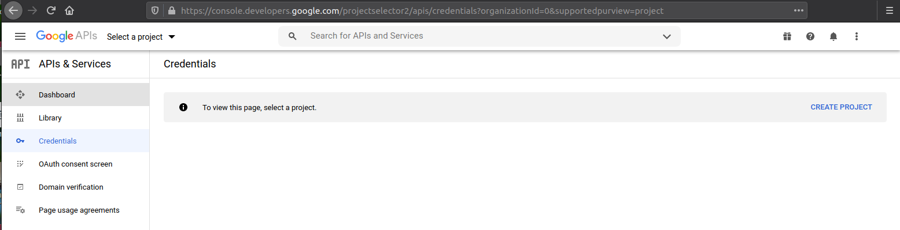

Select "CREATE PROJECT".

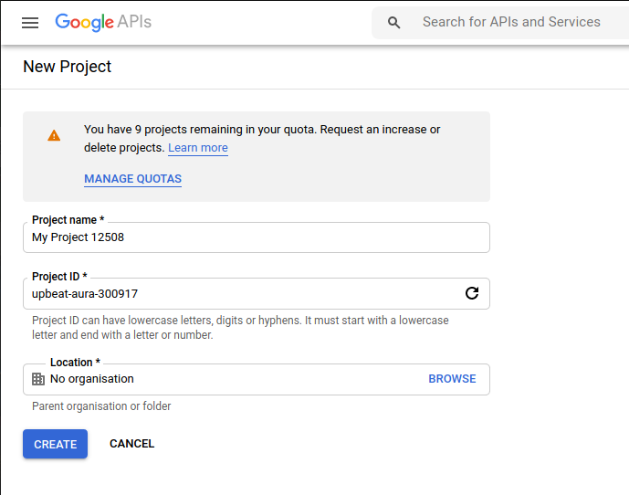

Set or accept the "Project name",

And optionally do the same with the "Project ID",

Leave "Location" on "No organization",

Click "CREATE".

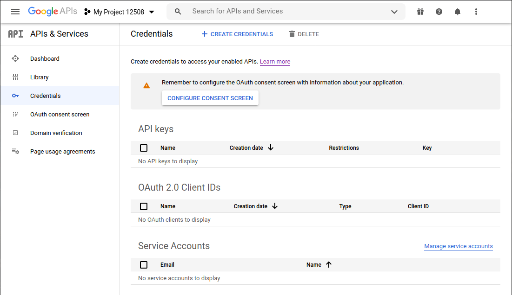

Click "+ CREATE CREDENTIALS".

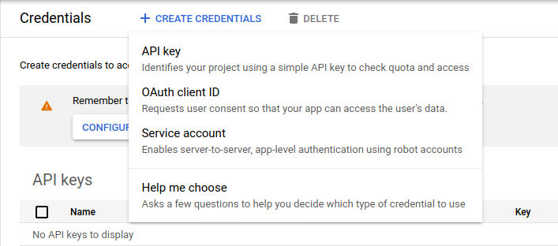

Select "OAuth client ID".

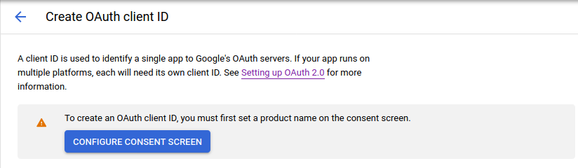

Click "CONFIGURE CONSENT SCREEN".

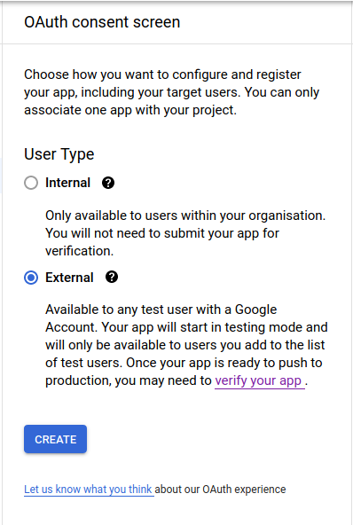

Select "External",

Click "CREATE".

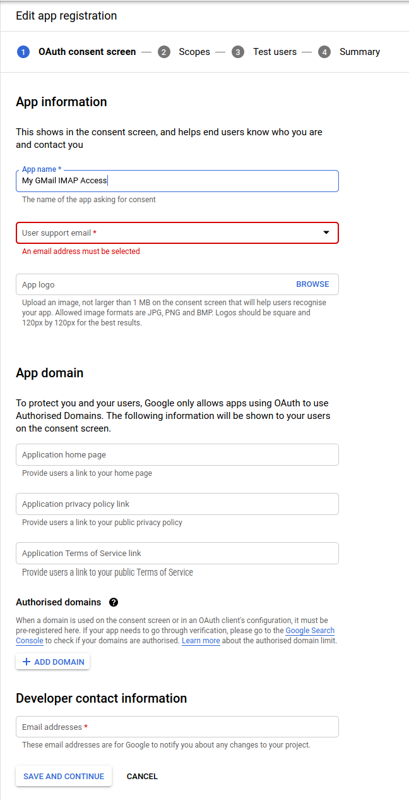

Fill in "App name",

Select your email as "User support email",

Type in your email at the bottom under "Developer contact information",

Click "SAVE AND CONTINUE".

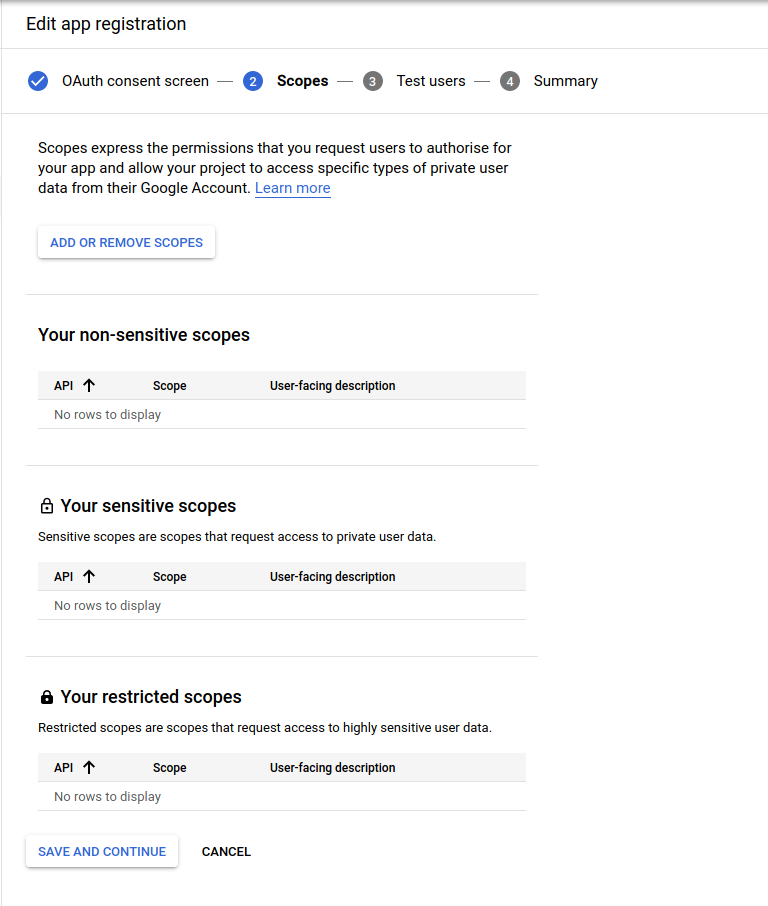

Click "ADD OR REMOVE SCOPES".

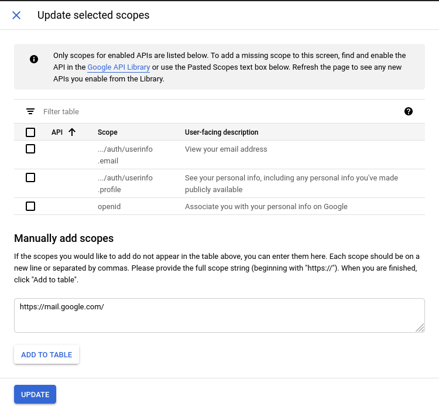

Under "Manually add scopes", type "https://mail.google.com/",

Click "ADD TO TABLE",

Click "UPDATE".

Click "SAVE AND CONTINUE".

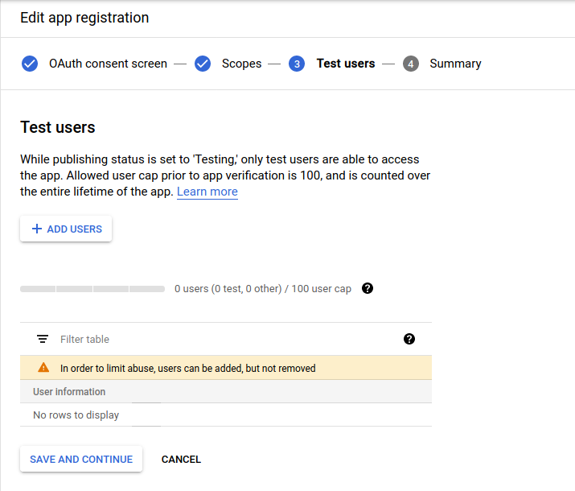

Click "+ ADD USERS".

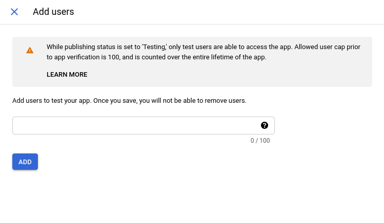

Type in your email,

Click "SAVE AND CONTINUE",

Click "BACK TO DASHBOARD",

Click "Credentials" in the menu

And then click "+ CREATE CREDENTIALS" again,

And select "OAuth client ID" again.

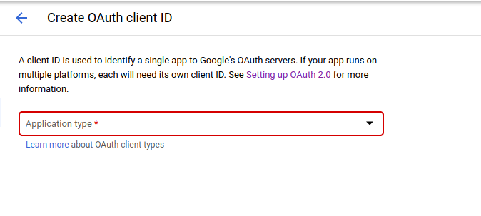

This time you will be able to proceed.

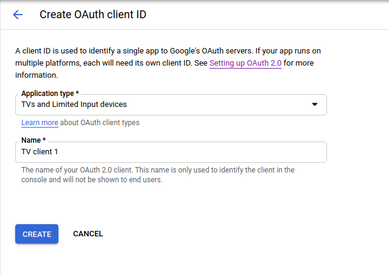

Select "TVs and limited input devices",

Click "CREATE",

Copy both "Your Client ID"

And "Your Client Secret".

# Set up imap_backup

Run `imap_backup setup`.

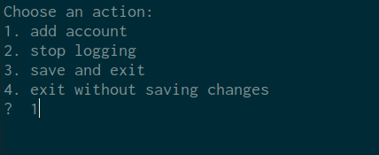

Choose 'add account'.

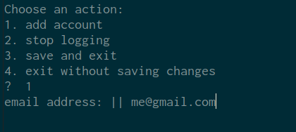

Type in your GMail address.

Note: if you have a custom domain (GSuite) address,
e.g. "me@mycompany.com", you now need to
choose 'server' and
type in 'imap.gmail.com'.

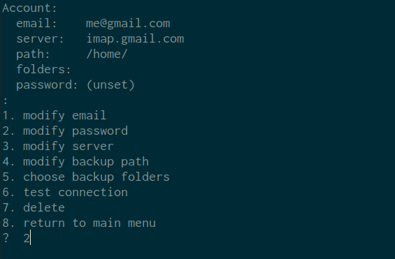

Choose `password`.

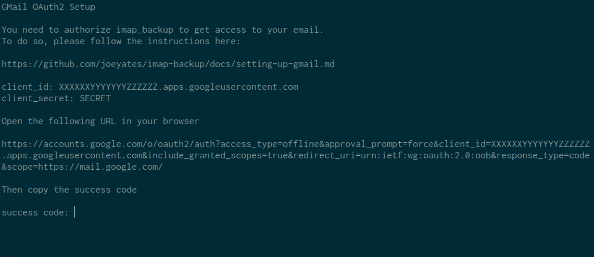

Type your "Client ID" and "Client Secret",

Next you will be shown a URL to open in your browser.

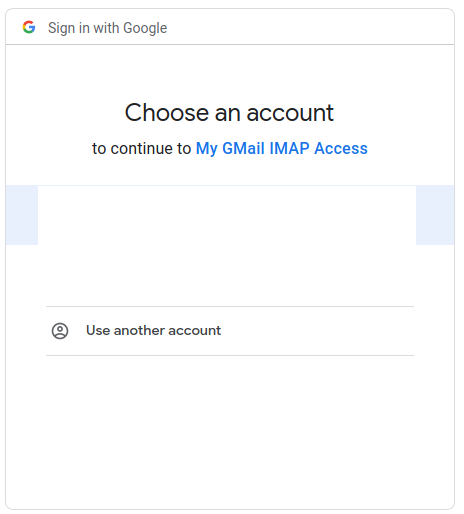

If you have more than one GMail account you will need to choose which
you are configuring.

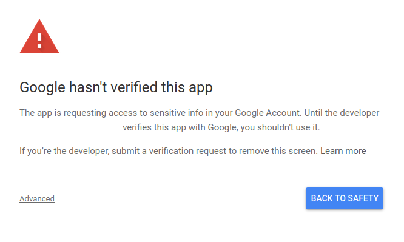

As the project "app" is in test mode,
you'll need to accept to ignore this warning.

Click "Advanced",

Then click "Go to XXXYYYZZZ (unsafe)"

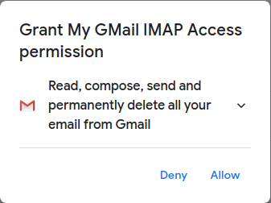

Choose "Allow".

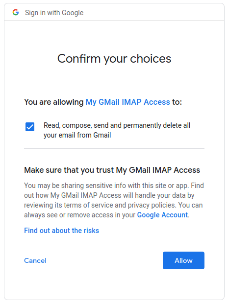

Choose "Allow".

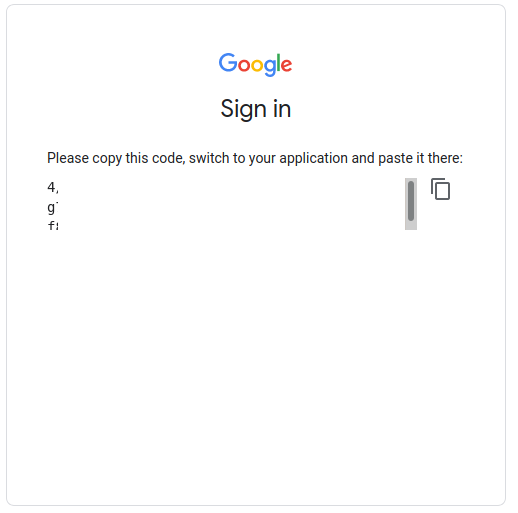

Click on the copy logo to copy the success code.

Paste the success code into imap_backup.

Finally, choose 'test connection'.

If all has gone well you should see this:

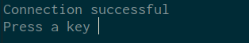

Now choose 'return to main menu',

Then 'save and exit'.

Your imap_backup is now configured to back up your GMail.
